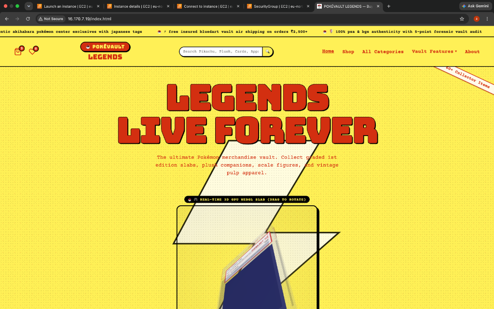
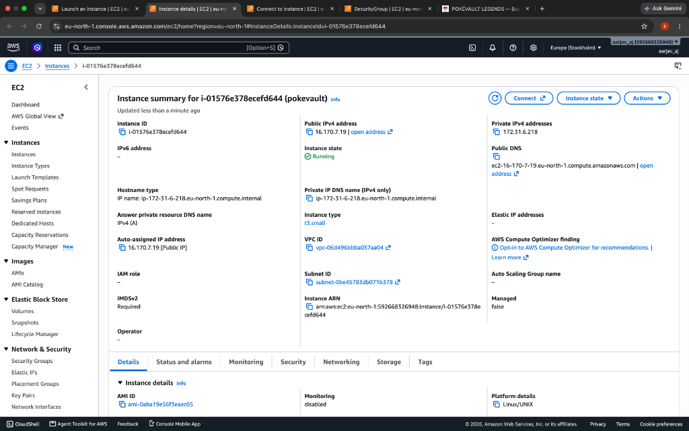
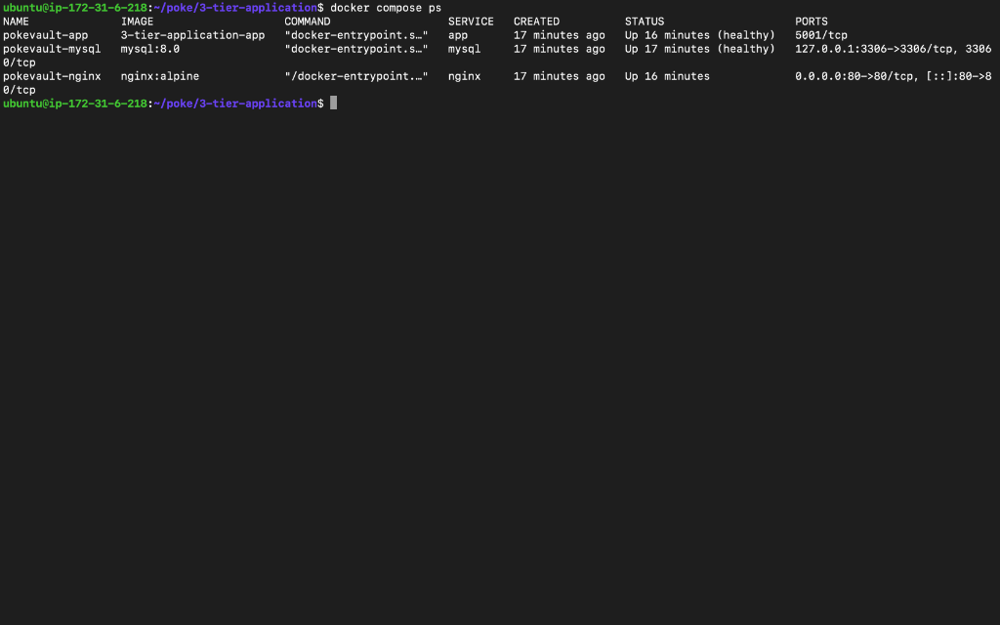
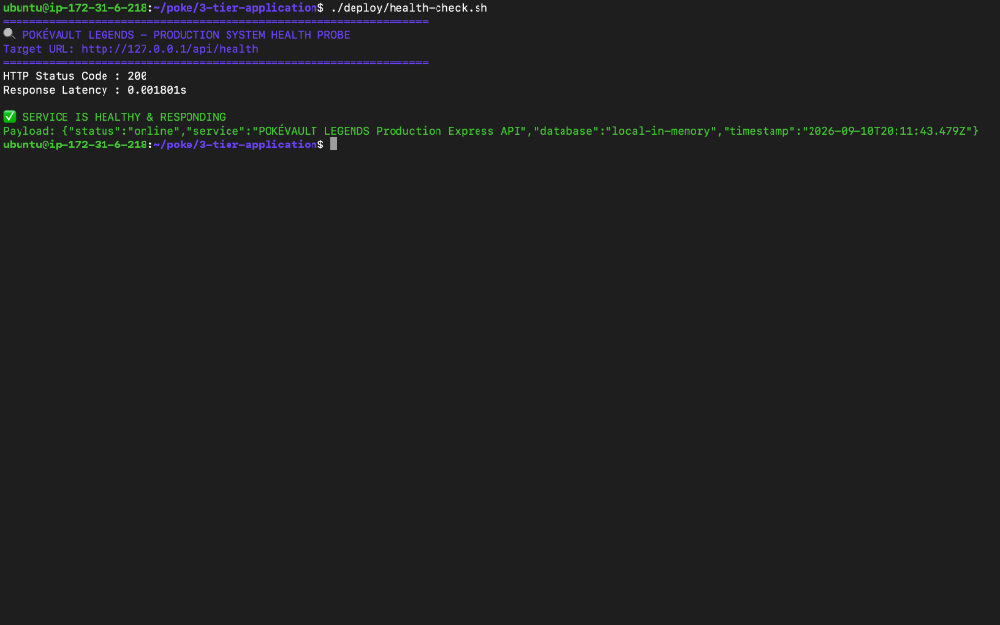
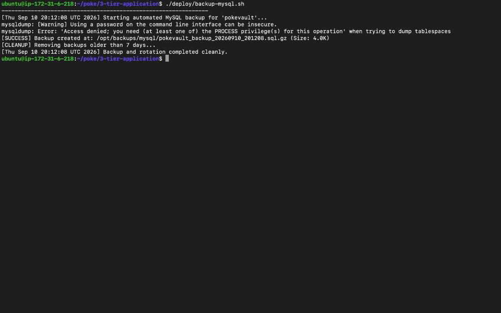

# ⚡ POKÉVAULT LEGENDS — 3-Tier Cloud-Native Architecture on AWS

[](https://aws.amazon.com/)
[](https://www.docker.com/)
[](https://docs.docker.com/compose/)
[](https://nginx.org/)
[](https://www.mysql.com/)
[](https://nodejs.org/)
[](https://www.gnu.org/software/bash/)
[](https://threejs.org/)

An enterprise-grade, high-performance **3-Tier Containerized E-Commerce Marketplace & Vault Platform** featuring real-time WebGL 3D holographic tilt physics (`Three.js`), dynamic multi-faceted search, tamper-proof server-side pricing, and a self-hosted **Production Cloud Architecture** on **AWS EC2**.

Transitioned from third-party serverless dependencies into a **cloud-native, multi-tier containerized stack** with automated provisioning, zero-downtime deployment pipelines, and automated database backup rotation.

---

## 📸 Production Deployment Proof (AWS EC2 & Docker)

<div align="center">

### 1. Live Storefront on AWS EC2 (Port 80 via Nginx)
<p align="center">
  
</p>
<p><i>Live WebGL 3D holographic rendering served over standard Port 80 via Nginx Reverse Proxy on AWS EC2 Public IP.</i></p>

<br />

### 2. AWS Management Console (EC2 Instance & VPC)
<p align="center">
  
</p>
<p><i>AWS EC2 Compute Instance (<code>t3.small</code>) running in <code>eu-north-1</code> with Public IP and Security Group rules.</i></p>

<br />

### 3. 3-Tier Container Composition (`docker compose ps`)
<p align="center">
  
</p>
<p><i>All 3 isolated containers (<code>pokevault-nginx</code>, <code>pokevault-app</code>, <code>pokevault-mysql</code>) running with passing health checks.</i></p>

<br />

### 4. Automated Health Probe & Sub-2ms Latency (`./deploy/health-check.sh`)
<p align="center">
  
</p>
<p><i>Automated liveness probe measuring an ultra-fast response latency of <b>0.0018s (1.8ms)</b> and HTTP 200 status.</i></p>

<br />

### 5. Automated MySQL Database Backup & Rotation (`./deploy/backup-mysql.sh`)
<p align="center">
  
</p>
<p><i>Automated <code>mysqldump</code> with gzip compression and 7-day retention rotation cleanup.</i></p>

</div>

---

## 🏗️ 3-Tier Production Cloud Architecture

```
                                  ┌────────────────────────────────────────────────────────┐
                                  │                AWS Cloud (Custom VPC)                  │
                                  │                                                        │
┌────────────────────────┐        │   ┌────────────────────────────────────────────────┐   │
│ Client / Web Browsers  │───────►│──►│           AWS Security Group Ingress           │   │
│ (HTTP: Port 80)        │        │   │           (Ports: 22, 80, 443 Allowed)         │   │
└────────────────────────┘        │   └───────────────────────┬────────────────────────┘   │
                                  │                           │ Ingress Traffic            │
                                  │                           ▼                            │
                                  │   ┌────────────────────────────────────────────────┐   │
                                  │   │         Amazon EC2 Compute Instance            │   │
                                  │   │  ┌──────────────────────────────────────────┐  │   │
                                  │   │  │ 1. Web Tier: Nginx Reverse Proxy (Port 80)│  │   │
                                  │   │  │    ├─ Gzip Compression & Rate Limiting   │  │   │
                                  │   │  │    ├─ Static 3D Asset Caching (1y exp)   │  │   │
                                  │   │  │    └─ OWASP Security Headers (HSTS, XSS) │  │   │
                                  │   │  └────────────────────┬─────────────────────┘  │   │
                                  │   │                       │ Proxy: Port 5001       │
                                  │   │                       ▼ (Docker Network)       │
                                  │   │  ┌──────────────────────────────────────────┐  │   │
                                  │   │  │ 2. App Tier: Node.js Express Application │  │   │
                                  │   │  │    ├─ Multi-Page Vite Frontend (dist/)   │  │   │
                                  │   │  │    ├─ REST APIs (/api/cards, /orders)    │  │   │
                                  │   │  │    └─ Liveness Probe (/api/health)       │  │   │
                                  │   │  └────────────────────┬─────────────────────┘  │   │
                                  │   │                       │ Pool: Port 3306        │
                                  │   │                       ▼ (Docker Network)       │
                                  │   │  ┌──────────────────────────────────────────┐  │   │
                                  │   │  │ 3. Database Tier: MySQL 8.0 Engine       │  │   │
                                  │   │  │    ├─ Relational Schema & Indexes        │  │   │
                                  │   │  │    ├─ Auto-Seeding (64+ Products)        │  │   │
                                  │   │  │    └─ Persistent Volume (mysql_data)     │  │   │
                                  │   │  └────────────────────┬─────────────────────┘  │   │
                                  │   └───────────────────────┼────────────────────────┘   │
                                  └───────────────────────────┼────────────────────────────┘
                                                              │
                                            ┌─────────────────┴─────────────────┐
                                            ▼                                   ▼
                               ┌─────────────────────────┐         ┌─────────────────────────┐
                               │ Automated Daily Backups │         │   PayPal Gateway API    │
                               │  (mysqldump + gzip)     │         │   (Payment Capture)     │
                               └─────────────────────────┘         └─────────────────────────┘
```

---

## 🛠️ Key DevOps & Cloud Engineering Highlights

### 1. Multi-Stage Docker Build Optimization
- **Stage 1 (Builder)**: Compiles the multi-page Vite frontend inside `node:20-alpine`.
- **Stage 2 (Runtime)**: Copies only compiled static assets and production dependencies (`--omit=dev`).
- **Security & Efficiency**: Runs under an unprivileged user (`USER node`), reducing image attack surface and slashing image size from **~1.2 GB down to ~140 MB** (~88% reduction).

### 2. 3-Tier Docker Compose Orchestration
- **`nginx`**: Web tier on port `80`, handling client ingress, proxy headers, and WebSockets.
- **`app`**: Application tier running on port `5001`, configured with `depends_on: mysql: condition: service_healthy`.
- **`mysql`**: Database tier running MySQL 8.0 with automated health checks (`mysqladmin ping`) and persistent named volumes (`mysql_data`).

### 3. Production Nginx Reverse Proxy & Caching
- **Static Caching**: Aggressive caching (`Cache-Control: public, max-age=31536000, immutable`) for Three.js 3D WebGL models (`.glb`, `.gltf`), images, and styles.
- **Gzip Compression**: Compresses JS, CSS, JSON, HTML, and SVG responses.
- **OWASP Security Headers**: Injects `X-Frame-Options: SAMEORIGIN`, `X-Content-Type-Options: nosniff`, and `X-XSS-Protection`.

### 4. Native MySQL 8.0 Engine & Connection Pooling
- **Asynchronous Connection Pool**: Built with `mysql2/promise` supporting connection pooling, query queuing, and auto-reconnection.
- **Auto-Migration & Auto-Seeding**: Inspects database state on container initialization; automatically creates DDL tables and seeds all 64+ Pokémon products and store settings if tables are empty.
- **Fault-Tolerant Fallback**: Gracefully falls back to in-memory local data mode if the database is unreachable during isolated tests.

### 5. Linux Shell Automation Suite (`deploy/`)
- **`setup-ec2.sh`**: Automated Ubuntu server bootstrapper (Docker engine, Docker Compose plugin, UFW firewall, and Linux kernel TCP/socket tuning).
- **`deploy.sh`**: Zero-downtime continuous deployment pipeline with automated Git sync, container image rebuilds, and `/api/health` validation.
- **`backup-mysql.sh`**: Automated database backup script executing `mysqldump`, gzip compression, timestamping, and 7-day retention rotation.
- **`health-check.sh`**: Production health probe testing HTTP status codes, response latency, and database connectivity.

---

## 📂 Repository Directory Structure

```text
pokevault/
├── .github/                      # 🔮 CI/CD Workflows (GitHub Actions)
│   └── workflows/
│       ├── ci.yml                # Automated test & build verification
│       └── cd.yml                # Docker build -> Amazon ECR -> EC2 deploy
│
├── deploy/                       # 🚀 Production Shell/Bash Automation
│   ├── setup-ec2.sh              # EC2 bootstrap provisioner (Docker, UFW, sysctl)
│   ├── deploy.sh                 # Zero-downtime container deployment pipeline
│   ├── backup-mysql.sh           # Automated MySQL backup & 7-day rotation
│   └── health-check.sh           # Liveness & latency monitoring probe
│
├── docker/                       # 🐳 Docker & Nginx Configurations
│   ├── Dockerfile                # Multi-stage production build (Node 20 Alpine)
│   ├── docker-compose.yml        # 3-Tier composition (Nginx, App, MySQL)
│   └── nginx/
│       ├── nginx.conf            # Reverse proxy, Gzip, Caching, SPA fallbacks
│       └── security-headers.conf # OWASP security headers
│
├── docs/                         # 📸 Visual Proof & Architecture Diagrams
│   └── screenshots/              # Terminal & deployment verification images
│       ├── 01-aws-ec2-console.png
│       ├── 02-live-storefront.png
│       ├── 03-docker-compose-ps.png
│       ├── 04-health-check.png
│       └── 05-mysql-backup.png
│
├── server/                       # ⚡ Backend API & Database Tier
│   ├── db/
│   │   ├── mysql.js              # Connection pooling, health check, auto-seeder
│   │   └── mysql_schema.sql      # Production MySQL 8.0 DDL Schema
│   ├── routes/                   # Cards, Inventory, Orders, PayPal, Settings, Auth
│   ├── middleware/               # Admin authentication & security middleware
│   └── index.js                  # Production Express Server
│
├── src/                          # 🎨 Frontend (HTML5, Vanilla JS, Three.js, React)
│   ├── components/               # 3D holographic card viewers, admin dashboard
│   ├── data/                     # 64+ Pokémon products, reviews, categories
│   └── lib/api.js                # Centralized REST API client
│
├── terraform/                    # 🔮 [Future Phase] Infrastructure as Code (IaC)
├── k8s/                          # 🔮 [Future Phase] Kubernetes Manifests / Helm
├── monitoring/                   # 🔮 [Future Phase] Prometheus & Grafana Dashboards
│
├── .dockerignore                 # Docker build context filter
├── .env.example                  # Environment configuration template
├── .gitignore                    # Git tracking ignore rules
├── Dockerfile                    # Root multi-stage Dockerfile
├── docker-compose.yml            # Root docker-compose configuration
└── package.json                  # Dependencies (No SaaS lock-in)
```

---

## 🚀 Quickstart & Local Deployment

### Prerequisites
- [Docker Desktop](https://www.docker.com/products/docker-desktop/) installed and running.

### 1. Clone & Run with Docker Compose
```bash
# Clone the repository
git clone https://github.com/itsme-aarjav/3-tier-application.git pokevault
cd pokevault

# Start all 3 tiers (Nginx + Express App + MySQL)
docker compose up --build -d
```

Open your browser and visit:
```text
http://localhost
```

---

## ☁️ Step-by-Step AWS EC2 Production Deployment

### 1. Launch AWS EC2 Instance
- **AMI**: Ubuntu Server 22.04 LTS or 24.04 LTS (x86_64).
- **Instance Type**: `t2.micro` or `t3.micro` / `t3.small`.
- **Security Group Rules**:
  - `SSH (Port 22)`: Your IP
  - `HTTP (Port 80)`: `0.0.0.0/0` (Anywhere)
  - `HTTPS (Port 443)`: `0.0.0.0/0` (Anywhere)

### 2. Connect via SSH
```bash
ssh -i /path/to/your-key.pem ubuntu@<YOUR-EC2-PUBLIC-IP>
```

### 3. Clone Repository & Run Automated Server Provisioning
```bash
# Clone repository into /opt/pokevault
sudo git clone https://github.com/itsme-aarjav/3-tier-application.git /opt/pokevault
sudo chown -R ubuntu:ubuntu /opt/pokevault
cd /opt/pokevault

# Make scripts executable
chmod +x deploy/*.sh

# Run automated EC2 provisioner (Installs Docker, UFW Firewall, and Tunes Kernel)
sudo ./deploy/setup-ec2.sh
```

### 4. Deploy the Entire Stack
```bash
# Add user to docker group if needed
sudo usermod -aG docker ubuntu
newgrp docker

# Run zero-downtime deployment pipeline
./deploy/deploy.sh
```

### 5. Access Live Application
Open your browser and navigate to:
```text
http://<YOUR-EC2-PUBLIC-IP>
```
- **Storefront**: `http://<YOUR-EC2-PUBLIC-IP>`
- **Admin Dashboard**: `http://<YOUR-EC2-PUBLIC-IP>/admin.html` *(Passcode: `pokevaultadmin123`)*

### 6. Setup Automated Daily MySQL Backups
```bash
crontab -e
```
Add this cron schedule to run backups daily at 2:00 AM:
```cron
0 2 * * * /opt/pokevault/deploy/backup-mysql.sh >> /var/log/pokevault/backup.log 2>&1
```

---

## 🔮 Future Extensibility Roadmap

The repository is modularly architected to accommodate upcoming DevOps tooling:
- **CI/CD Pipelines**: Adding `.github/workflows/` for automated unit testing, container build & push to **Amazon ECR**, and SSH deployment.
- **Infrastructure as Code (IaC)**: Adding `terraform/` to provision AWS VPC, subnets, EC2 instances, and Amazon RDS with one command (`terraform apply`).
- **Container Orchestration**: Adding `k8s/` or `helm/` manifests for Kubernetes cluster deployments and Horizontal Pod Autoscalers (HPA).
- **Observability**: Adding `monitoring/` with Prometheus and Grafana dashboards for live container and host metrics.

---

## 📜 License
This project is licensed under the MIT License — feel free to use and extend for personal and portfolio projects.
