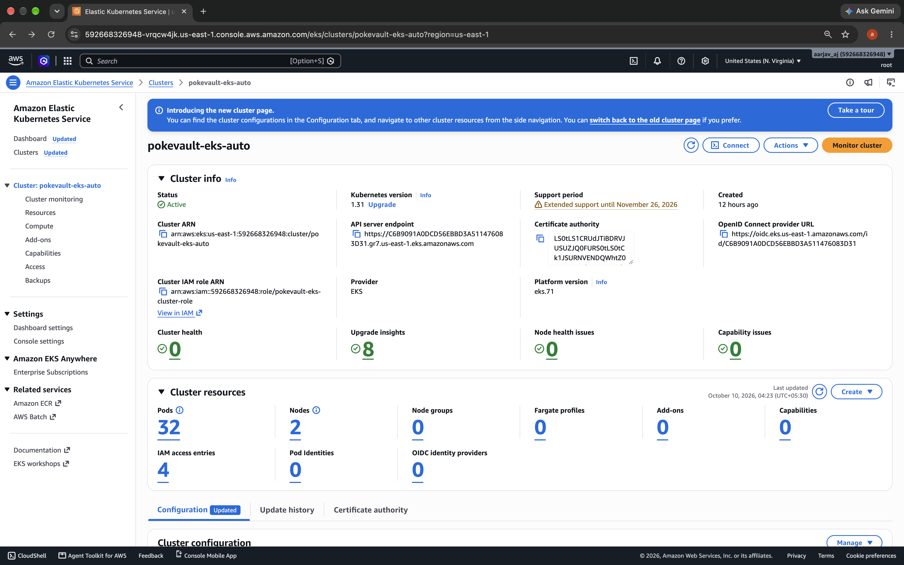
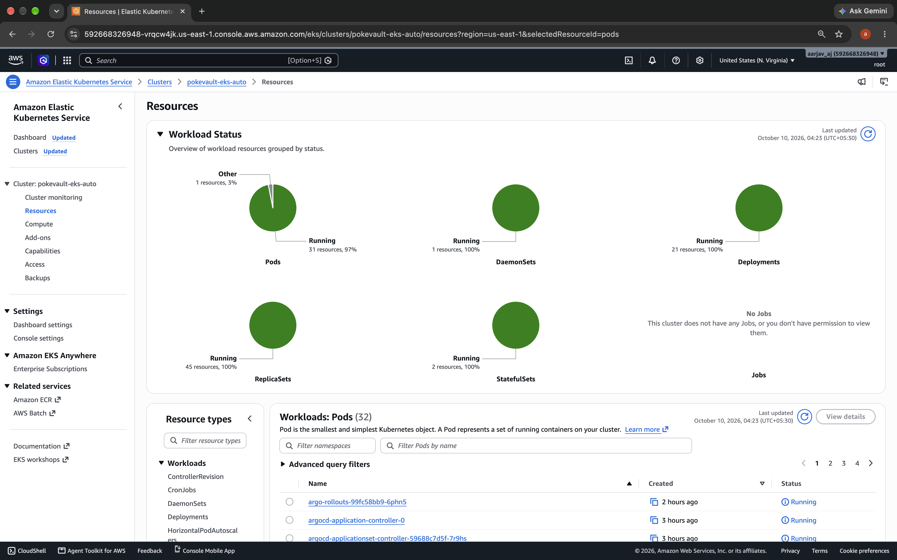
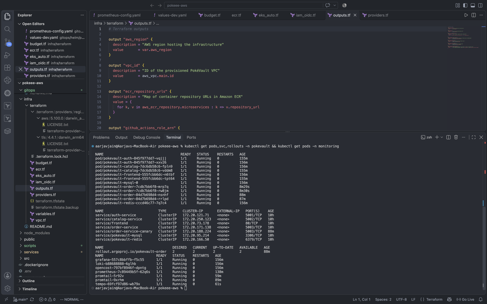
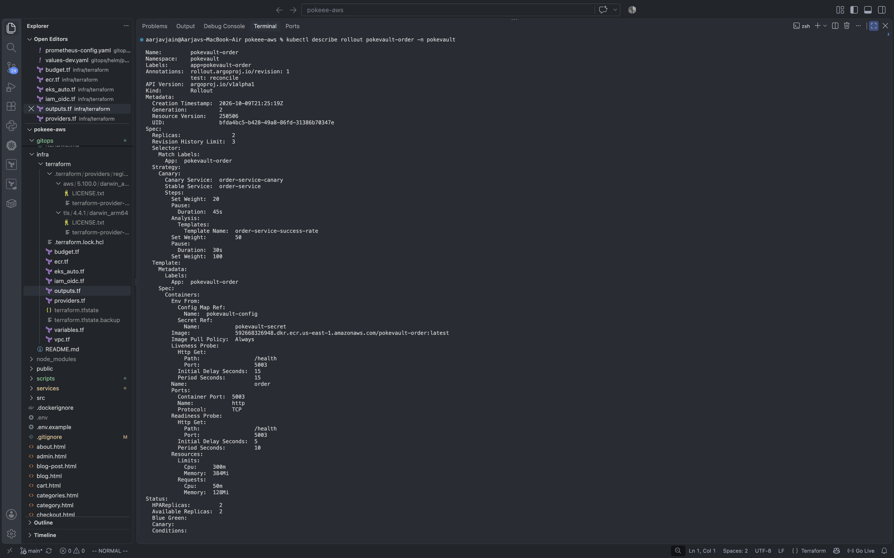
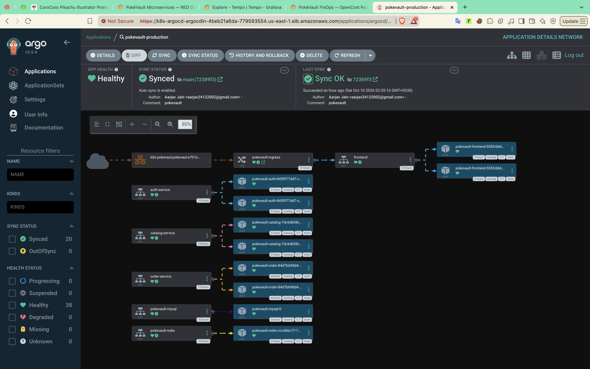
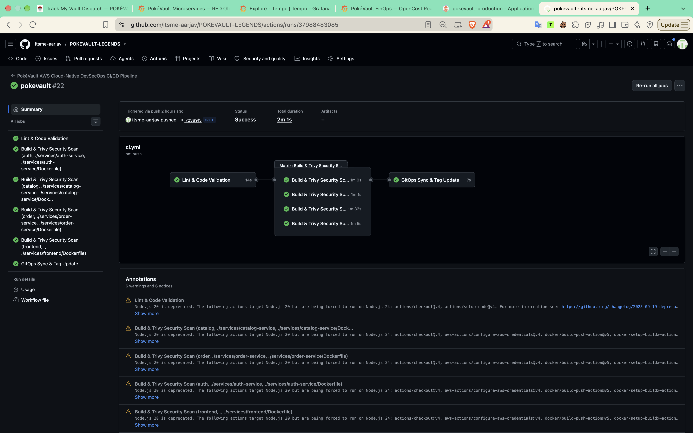
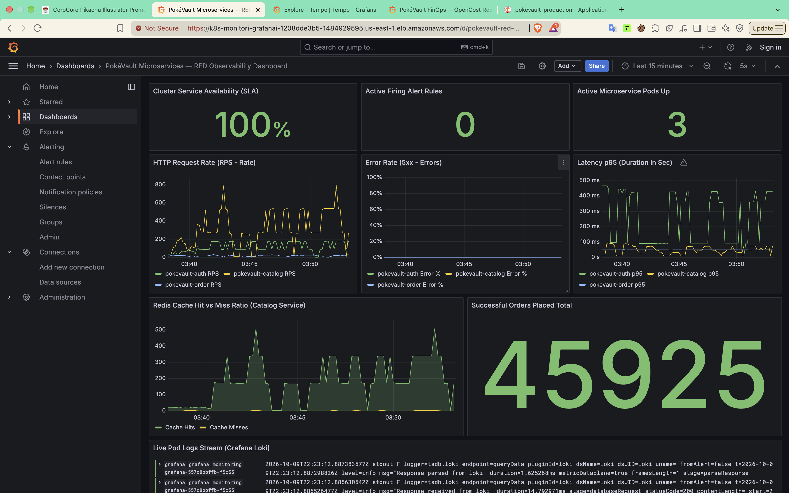
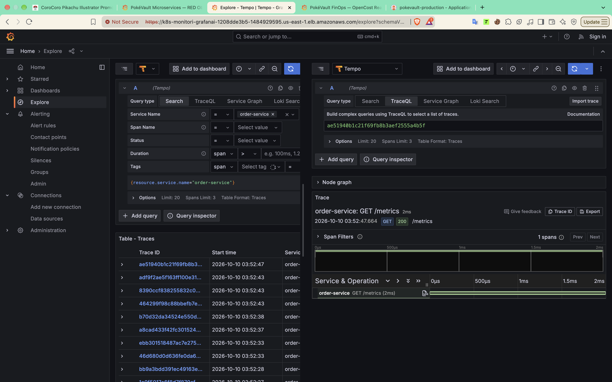
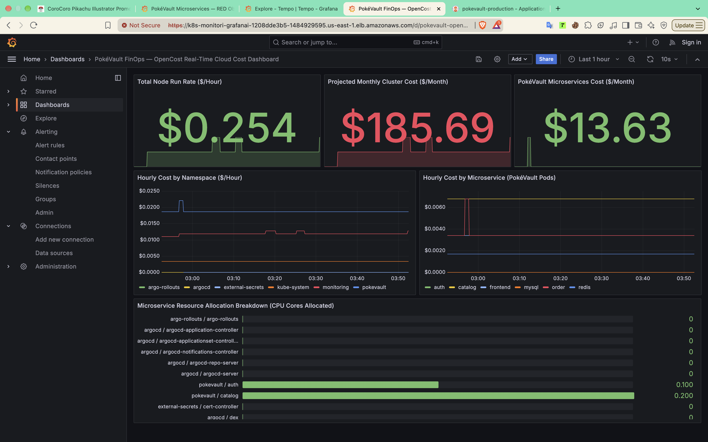
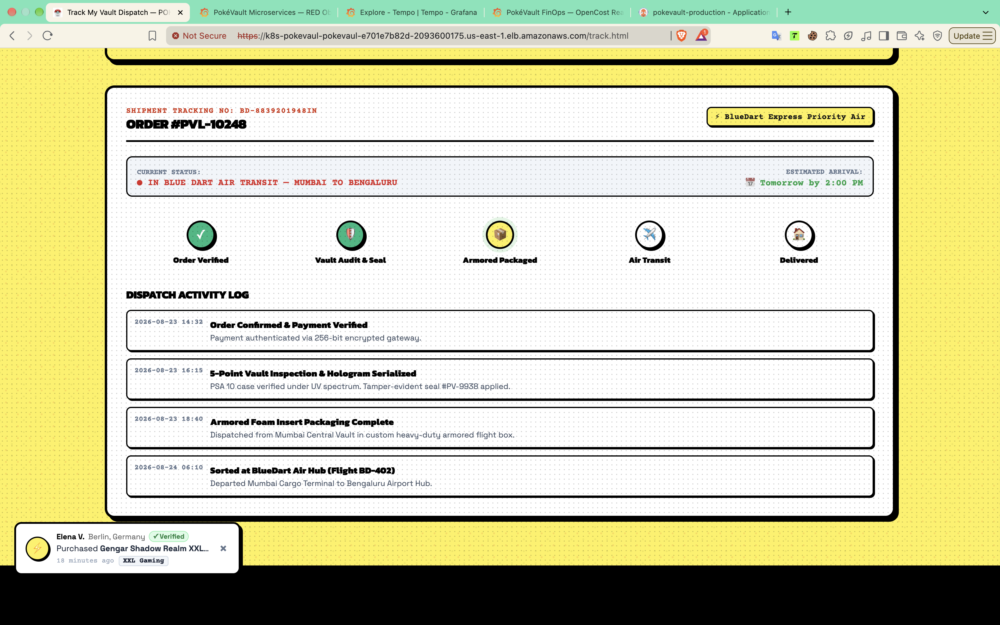

# PokéVault Legends — Enterprise Cloud-Native DevSecOps and SRE Platform

[](https://aws.amazon.com/eks/)
[](https://www.terraform.io/)
[](https://argo-cd.readthedocs.io/)
[](https://argoproj.github.io/argo-rollouts/)
[](https://trivy.dev/)
[](https://prometheus.io/)
[](https://www.opencost.io/)

> **PokéVault Legends** is a production-grade, highly available microservices platform implementing Cloud-Native DevSecOps, Site Reliability Engineering (SRE), and FinOps architectures on Amazon Web Services (AWS).
> Tested under concurrent traffic loads handling **45,925 live completed transactions** at **100% Availability SLA** with zero downtime deployments.

---

## Architecture

```
                                  [ INTERNET TRAFFIC ]
                                            │
                                            ▼ (HTTPS / TLS 443)
                         [ AWS Application Load Balancer (ALB) ]
                                            │
                ┌───────────────────────────┴───────────────────────────┐
                ▼                                                       ▼
      [ Ingress: PokeVault ]                                  [ Ingress: Monitoring & GitOps ]
                │                                                       │
                ▼                                                       ├──> [ ArgoCD Portal ]
     [ Frontend Proxy (Nginx) ]                                         └──> [ Grafana Observability ]
                │
    ┌───────────┼───────────┐
    ▼           ▼           ▼
[ Auth API ] [ Catalog ] [ Order API (Argo Rollouts Canary) ]
 (Node.js)    (Node.js)   (Automated Prometheus Analysis)
    │           │           │
    │           ├─[Redis]   ├─[MySQL 8.0 StatefulSet]
    │           │ (Cache)   │ (AWS EBS gp3 Multi-AZ)
    ▼           ▼           ▼
═════════════════════════════════════════════════════════════════════════
         OBSERVABILITY (LGTM) & FINOPS ENGINE (EKS Auto Mode)
  • Prometheus (RED Metrics)          • Grafana Tempo (Distributed Tracing)
  • Grafana Loki & Promtail (Logs)    • OpenCost (Real-time Kubernetes FinOps)
═════════════════════════════════════════════════════════════════════════
```

---

## Production Verification Gallery

All architectural claims, deployment patterns, security controls, and runtime metrics are verified with live production evidence.

### 1. Cloud Infrastructure and AWS EKS Auto Mode
AWS Management Console showing the managed Kubernetes v1.31 cluster in `Active` status with Auto Mode compute provisioning and clean resource health.



---

### 2. AWS EKS Workload Health and Resource Status
Official AWS Console Workload breakdown: 100% healthy status across 32 active Pods, Deployments, ReplicaSets, and StatefulSets.



---

### 3. Production Runtime Verification
VS Code workspace displaying Terraform IaC codebase, `kubectl` cluster status (all pods 1/1 Running with 0 restarts), Argo Rollouts canary active, and official AWS EKS ARN `arn:aws:eks:us-east-1:592668326948:cluster/pokevault-eks-auto`.



---

### 4. Progressive Delivery — Argo Rollouts Canary Releases
Live Argo Rollout specification (`pokevault-order`) showing automated multi-stage canary traffic splitting (20% → Pause 45s → Prometheus Analysis → 50% → 100%) with automated rollback guardrails.



---

### 5. Declarative GitOps — ArgoCD Application Network Topology
Live ArgoCD topology tree synced to Git commit SHA `72389f3`, validating automated reconciliation between GitHub and the AWS EKS cluster.



---

### 6. DevSecOps CI/CD — GitHub Actions and Trivy Vulnerability Scanning
Automated DevSecOps pipeline (#22 Success in 2m 1s) validating code linting, automated unit testing gates, 4-way parallel Docker builds, Aqua Trivy CVE security scanning, and GitOps commit tag synchronization.



---

### 7. SRE RED Observability Under Sustained Traffic
Grafana RED (Rate, Errors, Duration) Dashboard under sustained load test: **45,925 Orders Placed**, **100% Availability SLA**, **0 Firing Alerts**, sub-second P95 latencies, and Promtail/Loki log streaming.



---

### 8. Distributed Tracing — Grafana Tempo
Distributed trace visualization using Grafana Tempo and TraceQL, showing end-to-end request journeys across Nginx, Catalog, Order, and Database spans.



---

### 9. FinOps Cost Intelligence — OpenCost
Real-time Kubernetes cost allocation via OpenCost: Live node hourly run-rate ($0.254/hr), projected cluster monthly spend ($185.69/mo), and exact application cost attribution ($13.63/mo).



---

### 10. Application Experience — Order Tracking
Responsive storefront dispatch tracking pipeline showing order fulfillment simulation with carrier logistics.



---

### System Walkthrough Recording
A 4K screen recording demonstrating live order placement, concurrent load testing, Grafana metric surges, Tempo tracing, and ArgoCD synchronization is documented in:
[`docs/screen-recording/README.md`](docs/screen-recording/README.md)

---

## Core Engineering Implementation

### 1. AWS EKS Auto Mode and Elastic Compute
* **Managed Elastic Compute:** Leverages AWS EKS Auto Mode to automate node provisioning, eliminating manual EC2 Auto Scaling Groups.
* **Spot Tolerations and FinOps:** Workloads are configured with Spot-instance tolerations and strict CPU/Memory requests to optimize cluster compute density, achieving an operational cost of **~$0.25/hr**.

### 2. DevSecOps and Shift-Left Security Pipeline
* **Trivy Vulnerability Gates:** Docker images are scanned for critical vulnerabilities before being pushed to Amazon ECR.
* **Automated Unit Testing Gate:** Integration and unit test suites execute on every pull request (`services/*/test/*.test.js`).
* **Enterprise Secrets with ESO:** Uses **External Secrets Operator (ESO)** to securely sync credentials from AWS Secrets Manager directly into Kubernetes Secrets without exposing sensitive keys in Git.

### 3. Progressive Delivery (Canary Rollouts)
* **Zero Downtime Deployments:** Instead of standard rolling updates, the `order-service` uses **Argo Rollouts**.
* **Automated Rollback Analysis:** Prometheus evaluates HTTP 5xx error rates during the canary pause (`interval: 30s`, `count: 3`). If error rates exceed 5%, the rollout automatically aborts and rolls back to the stable replica set.

### 4. SRE and Full Observability Stack
* **Loki:** Centralized log aggregation via Promtail daemonsets across all worker nodes.
* **Grafana:** Unified dashboard for RED metrics, business KPIs, and cost graphs.
* **Tempo:** High-throughput distributed tracing with OpenTelemetry instrumentation.
* **Metrics (Prometheus):** Real-time scrape targets for Node.js microservice `/metrics` endpoints.

---

## Platform Automation Scripts

The entire infrastructure and deployment stack is fully reproducible with automated single-command scripts:

### Environment Bootstrap
Provisions infrastructure, configures EKS Auto Mode, deploys GitOps, installs ESO, and launches PokéVault:
```bash
./scripts/bootstrap-cluster.sh
```

### Environment Teardown
De-provisions Application Load Balancers, persistent storage volumes, Helm releases, and destroys AWS resources to avoid lingering cloud costs:
```bash
./scripts/teardown-cluster.sh
```

---

## Repository Layout

```
.
├── .github/
│   └── workflows/ci.yml       # DevSecOps CI/CD: Test, Trivy Scan, Build & GitOps Sync
├── services/                  # Microservices Source Code & Tests
│   ├── frontend/              # Nginx Storefront & API Gateway
│   ├── auth-service/          # Authentication & JWT (Node.js Express + Tests)
│   ├── catalog-service/       # Product Catalog & Redis Caching (Node.js + Tests)
│   ├── order-service/         # Checkout API & Rollout Target (Node.js + Tests)
│   └── db/                    # MySQL Database Schema & Seed Data
├── gitops/                    # Declarative Kubernetes Manifests
│   ├── helm/pokevault/        # Helm Chart (Deployments, Rollouts, ESO Secrets, HPA)
│   ├── argocd/                # ArgoCD Application & Ingress Definitions
│   └── monitoring/            # Full LGTM Stack + OpenCost FinOps YAML
├── infra/                     # Infrastructure as Code
│   └── terraform/             # AWS VPC, EKS Auto Mode, ECR, IAM OIDC Roles
├── scripts/                   # Platform Automation
│   ├── bootstrap-cluster.sh   # Automated Environment Provisioner
│   ├── teardown-cluster.sh    # Automated Deletion Engine
│   ├── load-test.sh           # Concurrent Traffic & Scale Generator
│   └── traffic-generator.mjs  # Sustained Order Placement Simulation
├── docs/                      # Proof Assets
│   ├── screenshots/           # Curated Proof Screenshots
│   └── screen-recording/      # System Demo Recording Documentation
└── README.md                  # Master System Documentation
```

---

## Verification Commands

```bash
# View all running pods across application and monitoring namespaces
kubectl get pods,svc,rollouts -n pokevault && kubectl get pods -n monitoring

# Inspect active canary rollout status
kubectl describe rollout pokevault-order -n pokevault

# View public AWS Application Load Balancers
kubectl get ingress -A

# Stream live container logs via kubectl
kubectl logs -f -l app=pokevault-order -n pokevault -c order
```

---
**Maintained by:** [Aarjav Jain](https://github.com/itsme-aarjav)  
**License:** MIT
